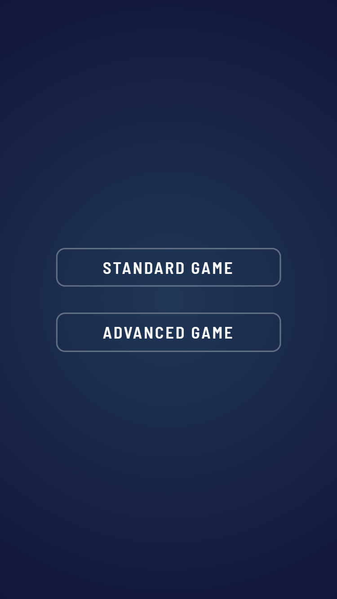
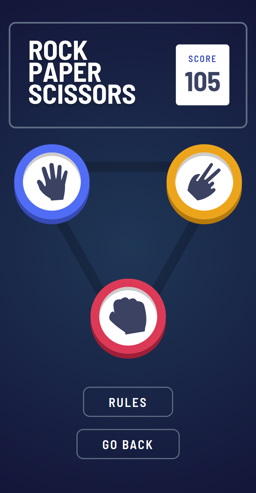
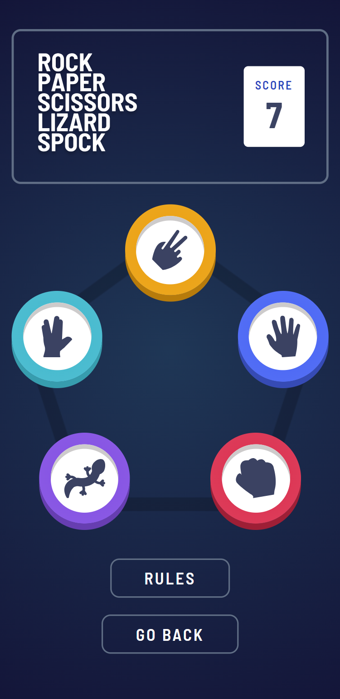
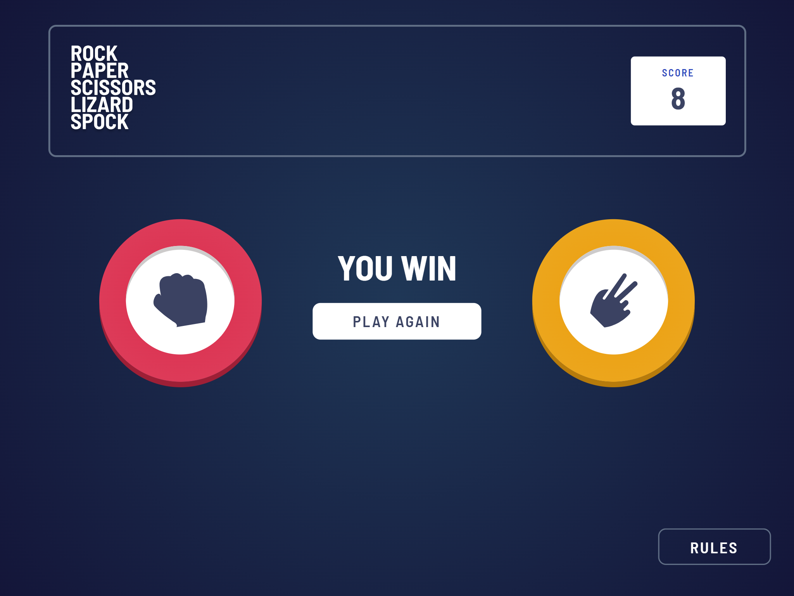
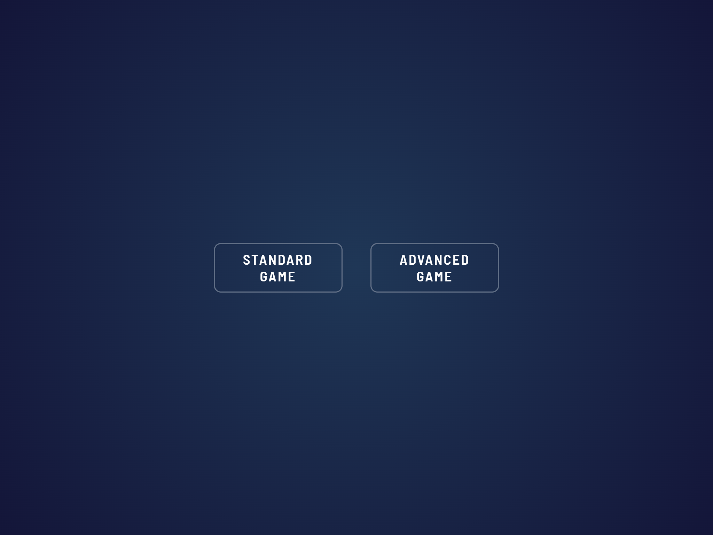
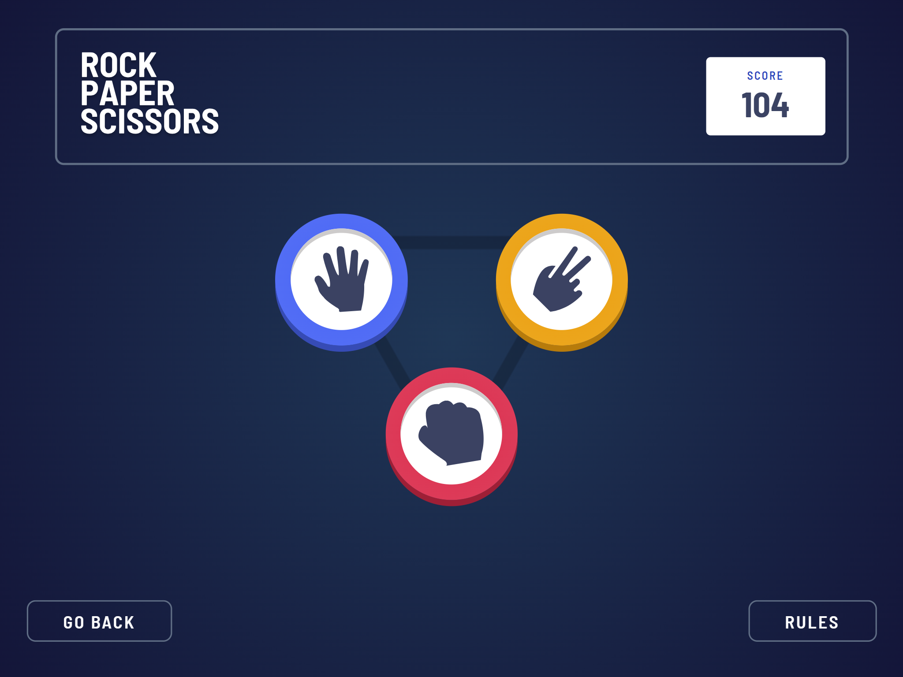
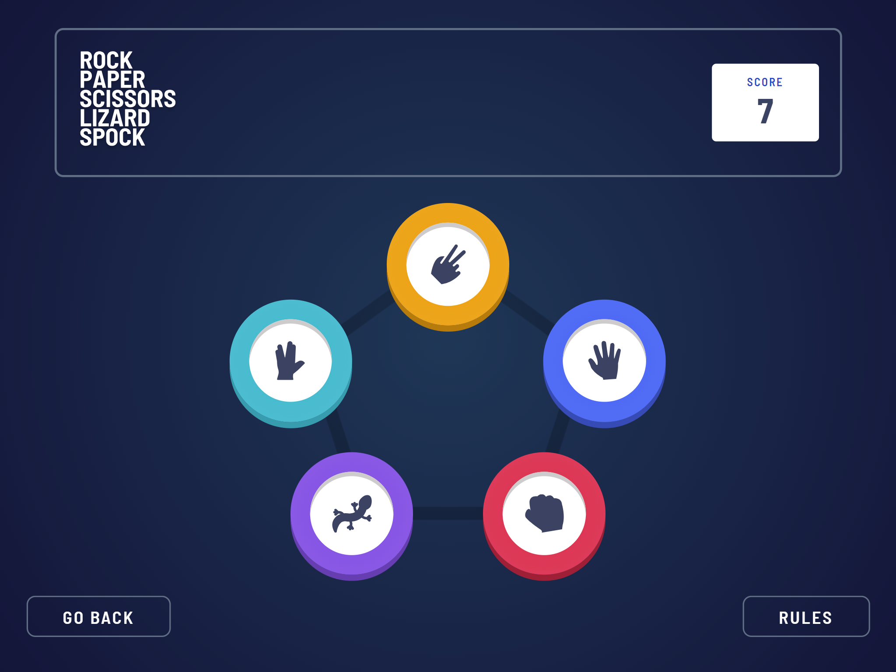

# Frontend Mentor - Rock, Paper, Scissors solution

Hi there!

Firstly, thank you for taking your time to review my project. This is a solution to the [Rock, Paper, Scissors challenge on Frontend Mentor](https://www.frontendmentor.io/challenges/rock-paper-scissors-game-pTgwgvgH).

## Table of contents

- [Overview](#overview)
- [Screenshot](#screenshot)
- [Built with](#built-with)

**Note: Delete this note and update the table of contents based on what sections you keep.**

## Overview

- Users can choose the difficulty level - standard (Rock/Paper/Scissors) or advanced (Rock/Paper/Scissors/Lizard/Spock).
- Based on the selected difficulty, users will see a different game board.
- From the main game board screen, users can go back to the selection screen to choose a different difficulty level.
- By clicking on the 'Rules' button, users can open a modal with simple rules explanation according to the selected difficulty level.
- Once the user clicks on one of the game buttons, they are forwarded to a result screen where they wait for the computer to select their figure.
- There can be 3 possible results: draw, win or loss.
- Score is updated accordingly for each difficulty level and is stored within the local storage.

### Screenshot

Mobile select screen:

Mobile game board (standard difficulty):

Mobile game board (advanced difficulty):

Mobile result screen:

Desktop select screen:

Desktop game board (standard difficulty):

Desktop game board (advanced difficulty):

Desktop result screen:

### Built with

- SCSS
- TypeScript
- React.js
- React Redux
- Mobile-first workflow

